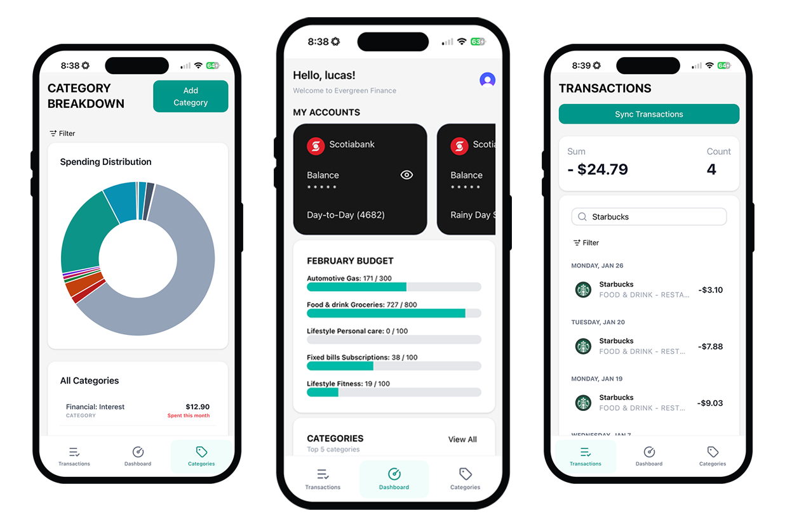

Finance Tracker | Full-Stack Web Application

A professional-grade financial management tool built with a Django REST Framework backend and a React frontend. This application allows users to track income, expenses, and overall financial health through a clean, intuitive dashboard.

🚀 Key FeaturesSecure Authentication: 
User registration and login using JWT (JSON Web Tokens).
Dynamic Dashboard: Real-time visualization of financial data and category-based breakdown.
CRUD Operations: Full ability to Create, Read, Update, and Delete financial transactions.
Responsive Design: Fully optimized for desktop and mobile viewing using modern CSS/React components.
RESTful API: Clean separation of concerns with a robust API architecture.

🛠️ Tech Stack
Frontend - React.js, Tanstack Query, Tailwind
BackendPython - Django, Django REST Framework (DRF)
Database - PostgreSQL, Redis, Celery Worker

📦 Installation & Setup
1. Backend (Django)

```bash
# Clone the repository
git clone https://github.com/PyLou317/dj-react-finance-app.git

# Navigate to backend folder
cd backend

# Install dependencies
pip install -r requirements.txt

# Run migrations
python manage.py migrate

# Start the server
python manage.py runserver
```

2. Frontend (React)

```Bash

# Navigate to frontend folder
cd frontend

# Install dependencies
npm install

# Start the development server
npm start
```


📈 Roadmap / Future Enhancements

[ ] Export functionality for CSV/PDF reports


👤 AuthorLucas Patriquin

LinkedIn: https://www.linkedin.com/in/lucas-patriquin/

Email: lucas.patriquin@gmail.com



